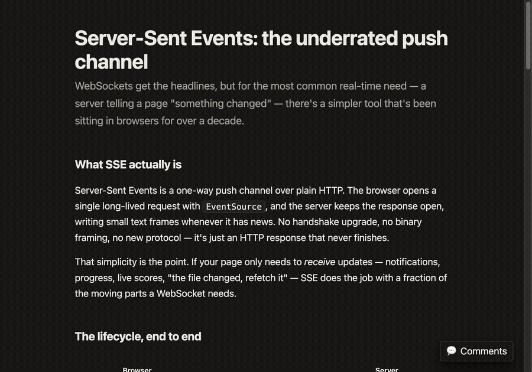
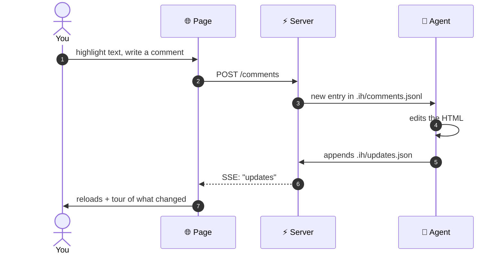

<div align="center">

# Interactive HTML

### Stop describing changes in chat. Point at them.

**Comment on local HTML pages — an AI agent applies the change and the page
updates in front of you.**

[](https://github.com/machbuilds/interactive-html/actions/workflows/ci.yml)
[](LICENSE)
[](https://www.python.org/)
[](#)
[](#three-ways-to-drive-it)



</div>

---

You know the loop: an AI generates a page that's 80% right, and then you
burn twenty minutes typing *"no, the other heading… smaller… not that
small…"* into a chat box.

This kills that loop. **Highlight the heading. Type "smaller". Done.**
The comment carries the exact element, so the agent never guesses what
"the other heading" meant — and the page reloads with the change
highlighted, scroll position preserved.

- ✏️ **Change** — highlight text or pick an element, say what's wrong,
  watch it get fixed
- ❓ **Question** — don't understand a section? Ask in place. The agent
  answers in a Q&A panel **without touching the page**. Your questions
  build a list automatically — no copy-paste
- ▭ **Region** — can't put it into words? Drag a box around the messy
  area and say "make this better". The agent receives every element you
  circled

It's ~43KB of vanilla JS injected into your pages, a stdlib-only Python
server, and an [open file protocol](PROTOCOL.md) any agent can speak.
No build step, no npm, no pip install. Your HTML stays static — strip the
layer back out with one command.

## Quickstart

```bash
git clone https://github.com/machbuilds/interactive-html
cd interactive-html
python cli/ih.py examples
```

One command starts everything — server, watcher, agent. Your browser opens,
you highlight a sentence, write a comment, hit Submit. A few seconds later
the page reloads with the change applied and a walkthrough of what changed.

`Ctrl-C` stops it all. The default agent is `claude -p` (Claude Code
headless — uses your existing login, **no API key needed**).

## Three ways to drive it

### 1 · Claude Code skill — fastest loop

```bash
git clone https://github.com/machbuilds/interactive-html
python interactive-html/cli/install_skill.py
```

That's it — installs the skill into `~/.claude/skills/`, fully
self-contained. In any Claude session, two ways to invoke:

> **"make this page interactive"** — comment loop on the HTML files you
> already have. The session *itself* becomes the agent (no second process,
> no cold start) and questions get conversational-quality answers in place.
>
> **"build me a page about …"** — generates a polished, self-contained
> page first (design tokens, light/dark, inline-SVG diagrams, responsive,
> zero network deps), then chains into the comment loop on it. Create with
> words, refine by pointing — one skill, both halves.

### 2 · Cursor

```bash
cp adapters/cursor/interactive-html.mdc .cursor/rules/
```

*"make this page interactive"*, then *"process new comments"* after you
submit. Details in [adapters/cursor/](adapters/cursor/).

### 3 · Headless — no chat window at all

```bash
python cli/ih.py ./your-pages
```

The watcher dispatches comments to `claude -p`, to the bundled
dependency-free Anthropic agent (`--agent builtin`, needs
`ANTHROPIC_API_KEY`), or to any CLI that reads a prompt on stdin
(`--agent-cmd "your-cli"`). Comments queue safely on disk even when
nothing is listening — the next run picks up the backlog.

## How it works

One loop, a few seconds per round trip:



| | Who | What happens |
|---|---|---|
| 💬 | **You** | Highlight prose, pick an element, drag a region, or ask a question |
| 📥 | **Page → Server** | Comment lands in `.ih/comments.jsonl` |
| ✏️ | **Agent** | Edits the HTML — or answers the question — and records it in `.ih/updates.json` |
| 🔔 | **Server → Page** | SSE event the instant the file changes |
| ✨ | **Page → You** | Auto-reload + guided tour of changes, or the answer appears in the Q&A tab — no reload |

The file contract is the real product: `.ih/comments.jsonl` in,
`.ih/updates.json` out, `data-ih-change` anchors in the HTML. It's fully
specified in [PROTOCOL.md](PROTOCOL.md) — implement it in any language and
your agent interoperates with this client. Everything in this repo is a
reference implementation.

## What you get

- **Four comment surfaces** — text selection, element pick (shift-click
  for more), region drag, and page-level notes
- **Questions as a first-class intent** — answers render in place, no
  page reload, anchored to where you asked
- **Live agent status** — the busy banner streams real progress
  ("editing report.html…") over SSE
- **Tour on reload** — every change gets a title and a highlighted
  region; arrow keys to walk through
- **Scroll preserved** across reloads — comment at the bottom, stay at
  the bottom
- **SSE-driven** — the page reacts ~1s after the agent finishes; a slow
  poll exists only as a fallback
- **Restart-safe** — processed batches tracked in a cursor file; nothing
  replays, nothing is lost
- **Localhost-only by default** — the server binds `127.0.0.1`; your
  pages and your agent are not exposed to the network
- **Reversible** — `python cli/inject.py <dir> --remove` returns clean
  static HTML

## Layout

```
interactive-html/
├── PROTOCOL.md       # the file/HTTP contract — implement this and you're done
├── LICENSE           # MIT
├── client/
│   ├── ih.js         # injected into every page
│   └── ih.css
├── server/
│   └── server.py     # stdlib HTTP + SSE
├── cli/
│   ├── ih.py         # one-command launcher
│   ├── inject.py     # idempotent tag injection / removal
│   ├── watch.py      # dispatches new comment batches to an agent
│   └── install_skill.py   # installs both Claude Code skills
├── agent/
│   └── agent.py      # bundled Anthropic agent (urllib, no SDK)
├── skills/
│   └── interactive-html/   # the skill: "make this page interactive"
│                           # or "build me a page about …"
├── adapters/
│   └── cursor/       # Cursor .mdc rule + install notes
└── examples/
    ├── sample.html         # minimal smoke-test page
    └── sse-explainer.html  # a real artifact — generated by the skill
```

## FAQ

**Do I have to keep a chat open?**
Only in skill mode, where your live Claude session is the agent (that's
also the fastest mode). Headless mode (`cli/ih.py`) needs no chat — just a
terminal. And comments persist on disk either way: anything submitted
while nothing is listening gets processed by the next session or watcher
run.

**Does it work on a deployed site?**
It's a local-first tool by design: the agent needs filesystem access to
edit your HTML, and the server intentionally binds localhost with no auth.
Run it next to the files, not in production.

**What does the agent cost?**
Skill mode and the default headless agent ride your existing Claude
subscription. The bundled `--agent builtin` uses the Anthropic API
directly (per-token billing, `ANTHROPIC_API_KEY`).

**Can I write my own agent?**
Yes — that's the point. Read [PROTOCOL.md](PROTOCOL.md); a conforming
agent is "read a JSONL line, edit HTML, append one JSON object."

## Status & roadmap

V1, single-author, used in real iteration loops daily. The protocol and
HTTP surface are stable (additive changes only). On the roadmap — and
open for contribution:

- Comment threads (replies, resolved/unresolved)
- Multi-user presence over the existing SSE channel
- More agent adapters (Codex, Gemini CLI, local models)
- A single-shot agent mode (one API call for small edits)

## License

[MIT](LICENSE). Use it however you want.
